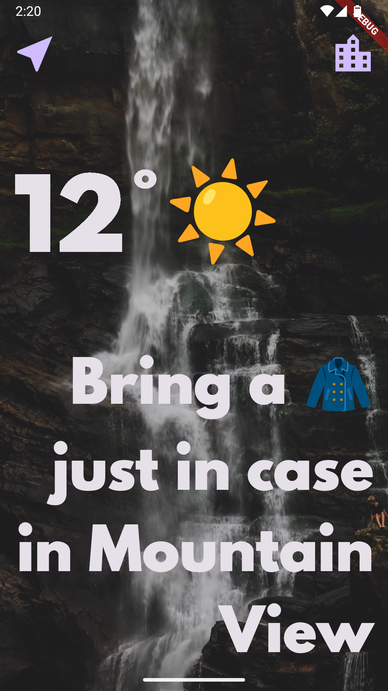
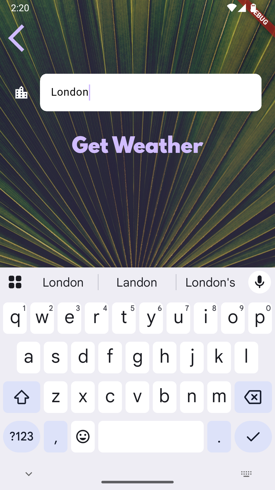
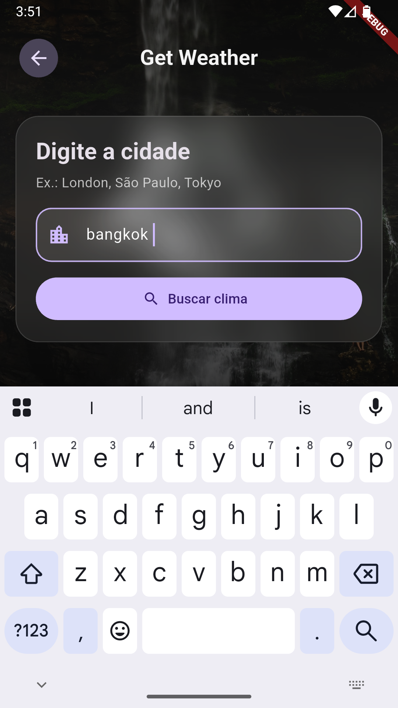

# 🌤️ Weather App (Flutter)


# 📱 Demo
<p align="center">
	
    
    
</p>


A simple and clean **Weather App built with Flutter** that allows users to check real-time weather data based on their current location or by searching for a city.

This project was created as part of my Flutter learning journey, focusing on API integration, asynchronous programming, and clean project structure.

---

## 📱 Features

- 🌍 Get weather data using the **current device location**
- 🔍 Search weather by **city name**
- 🌡️ Display temperature and weather conditions
- ⚡ Real-time data from a weather API
- 📱 Responsive UI for mobile devices

---

## 🛠️ Technologies Used

- **Flutter**
- **Dart**
- **HTTP requests**
- **Geolocation**
- **REST API integration**

---

## 📂 Project Structure

```
lib/
├── main.dart
├── screens/
│ ├── loading_screen.dart
│ ├── location_screen.dart
│ └── city_screen.dart
├── services/
│ ├── location.dart
│ ├── networking.dart
│ └── weather.dart
├── utils/
│ └── constants.dart
```
